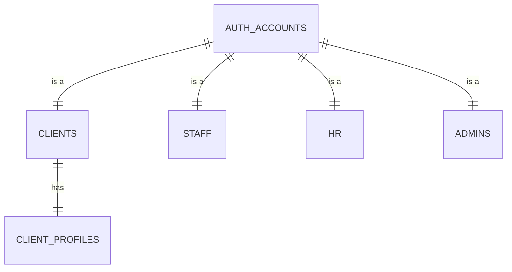
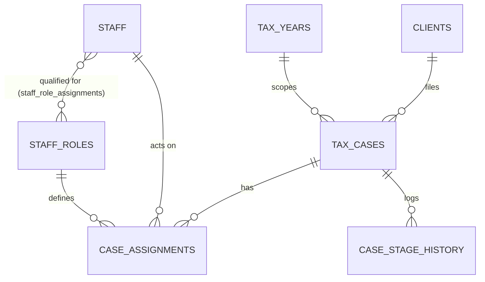
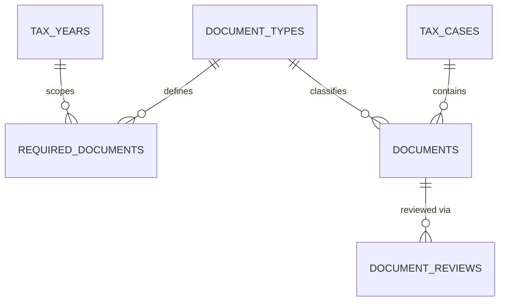
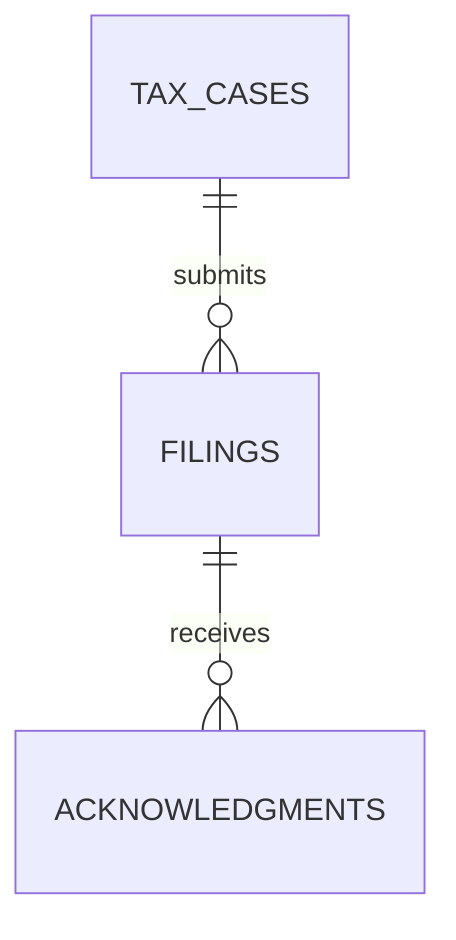
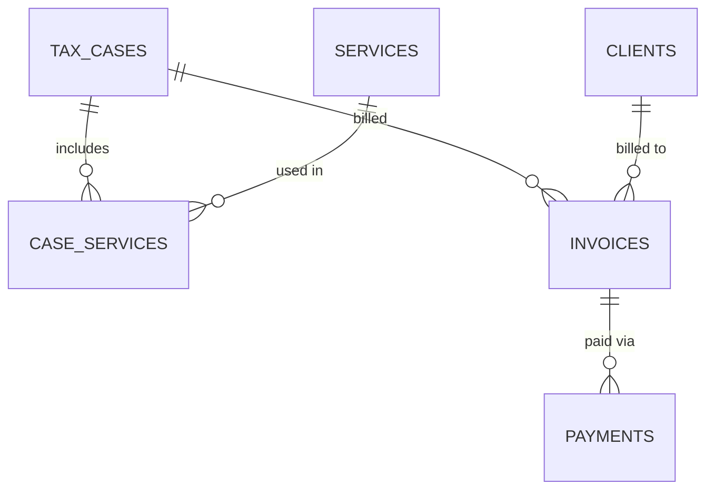
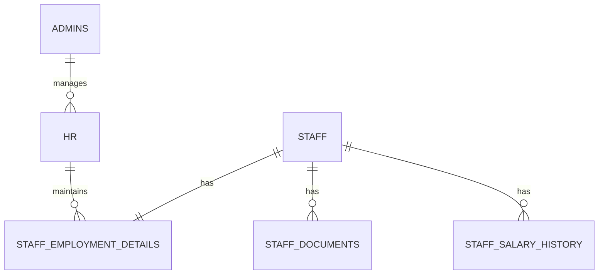

# UrTax — Final Data Model (reconciled)

Status: **final reconciled proposal** — merges your table list with the earlier plan
([docs/DATABASE_IMPLEMENTATION_PLAN.md](../docs/DATABASE_IMPLEMENTATION_PLAN.md), which still holds the
RLS policies, indexing notes, and rollout phases — this file is the authoritative **table catalog**).
No migrations have been applied yet.

---

## 1. Reconciliation notes — read this first

### 1.1 ✅ Auth/credentials — confirmed: keep the existing `auth_accounts`, don't duplicate it
Your list puts `email`, `password_hash`, `is_active`, `is_verified`, `last_login_at` directly on `clients`,
`staff`, and `admin`. The codebase already has a **working, unified** credentials table —
[auth_accounts](../app/models/auth.py) — shared by all account types, plus `auth_sessions`,
`auth_refresh_tokens`, `auth_password_reset_tokens`, `auth_email_verification_tokens`, `auth_login_attempts`
all keyed off it ([auth_service.py](../app/services/auth_service.py), [deps.py](../app/core/deps.py)).

Duplicating credential columns per role would mean:
- Losing global email-uniqueness across account types (today a client and a staff member can't share an email).
- Re-implementing session/refresh-token/password-reset/email-verification 4× (once per role) instead of once.
- Rewriting already-working, tested login code.

**Decision: keep `auth_accounts` as the single credentials table.** `clients` / `staff` / `admins` / `hr`
(new) stay **profile-only** tables with `account_id → auth_accounts.id`, exactly like today. Your
`client_number` / `staff_number` / `admin_number` pattern is unaffected — it already coexists with
`auth_accounts.account_number` in the current code.

### 1.2 `client_profiles` vs. one `clients` table
Today's `clients` table already merges identity + address + DOB fields
([client.py](../app/models/client.py)). Splitting into `clients` (identity) + `client_profiles`
(address/DOB) is valid normalization, but it means touching working code
([profile.py](../app/services/client_profile.py), [profile.py](../app/api/profile.py)) for no immediate
functional gain. **Recommendation: keep the single `clients` table as today** unless you have a concrete
reason to split (e.g. multiple addresses per client). Noted as optional, not adopted below.

### 1.3 Your question: *"case_assignments — instead of a separate table, can we just change the stage?"*
**Keep it as a separate table.** Stage (`tax_cases.stage`) answers *"where is this case in the pipeline"*.
`case_assignments` answers a different question — *"which specific staff member owns this case, in which
role, right now"* — and a case has **up to 4 people attached at once** (Initiator/Preparer/Reviewer/Manager),
not one. Folding this into `stage` would break:
- Staff "My Queue" (`WHERE staff_id = ? AND status = 'active'`) — can't derive this from stage alone.
- Reassignment without a stage change (someone goes on leave, case gets handed off mid-stage).
- Per-staff performance stats (avg handle time, cases closed) — needs to know who, not just when the stage moved.

`case_stage_history` is complementary, not a substitute: it logs *transitions*, `case_assignments` tracks
*current ownership per role*.

### 1.4 `tax_years` — adopted, and it fixes something we already built
Your `tax_years` table (`id, year, is_open`) is a genuinely good addition I hadn't proposed. It directly
replaces the hardcoded `current_year - 4 … current_year` Python list in
[dashboard.py](../app/api/dashboard.py)'s year-picker (`_available_tax_years()`) with an
admin-configurable, DB-driven list (`SELECT year FROM tax_years WHERE is_open = true ORDER BY year DESC`).
This is a direct, immediate win for the feature we already shipped.

### 1.5 `document_types` + `required_documents` — adopted
Lets admin configure, per `tax_year` + `tax_type`, which document types are mandatory — no code change
needed when requirements shift year to year. This is the config-driven flexibility the business asked for.

### 1.6 `documents.version` + `document_reviews` — adopted, and they're complementary
`version` handles re-upload cycles (client re-submits after rejection); `document_reviews` handles the
review/approval cycle on top of a given version. Using both (rather than my earlier single-column
`verified_by`/`verified_at`) is more accurate.

### 1.7 Polymorphic actor columns (`*_type` + `*_id`) — adopted, with one caveat
Your pattern of `actor_type/actor_id`, `uploaded_by_type/uploaded_by_id`, `changed_by_type/changed_by_id`,
`filed_by_type/filed_by_id`, `acknowledged_by_type/acknowledged_by_id`, `reviewed_by_type/reviewed_by_id`,
`recipient_type/recipient_id` is consistent and lets any of CLIENT/STAFF/ADMIN be an actor without one FK
column per type. Trade-off: Postgres can't enforce a normal FK across three possible target tables from one
column pair. Mitigate with an app-layer/service check (or a `CHECK` constraint validating `*_type` against
the enum) rather than skipping validation — flagging so it isn't forgotten, not blocking adoption.

### 1.8 `filing_method` — added (missing from your list, needed for the paper vs. Form 8879 branch)
Added `tax_cases.filing_method` (`PAPER_FILING | FORM_8879`, nullable until decided at Review) — this is
what determines whether a case's `filings` row goes through an e-file acknowledgment or straight to
completed, per the workflow you described earlier.

### 1.9 HR domain — not in your list, still required per your earlier business context
Your list has no HR tables. Keeping them here as a clearly-marked **addition**, matching what you asked
for earlier (HR manages staff phone/email/job docs/employment/salary — HR has no visibility into
tax case data at all):
- `hr` (own login, same flattened style you used for `staff`/`admin` — see note in 1.1 about whether this
  goes through `auth_accounts` instead)
- `staff_employment_details`, `staff_documents` (HR-managed employment docs — distinct from case
  `documents`), `staff_salary_history`

### 1.10 Client-facing 5 states — derived mapping, not a stored column duplication risk
`tax_cases.stage` still holds the detailed internal pipeline. The 5 client-visible states
(`Submitted / In Progress / Completed / Closed / Amendment`) are a many-to-one mapping applied once in a
service function — see Section 4.

### 1.11 What I did *not* add back in
Your simpler `stage` + `case_stage_history.comment` approach (vs. my earlier separate `filing_issues` /
`client_action_items` tables) is adopted as-is for MVP — it's simpler and sufficient as long as a case only
needs **one** open blocking reason at a time (e.g. either docs-pending or info-pending, not both
independently tracked). If you later need multiple concurrent, independently-resolved blockers on one case,
a `case_issues` table is the Phase-2 add — not needed now.

---

## 2. Final table catalog

### CLIENT
**`clients`** *(profile only — credentials live in `auth_accounts`, see 1.1)*
`id`, `account_id` FK → `auth_accounts.id`, `client_number`, `first_name`, `last_name`, `phone`,
`created_at`, `updated_at`

**`client_profiles`**
`id`, `client_id` FK → `clients.id`, `date_of_birth`, `address_line_1`, `address_line_2`, `city`, `state`,
`postal_code`, `country`, `created_at`, `updated_at`

### STAFF
**`staff`** *(profile only, see 1.1)*
`id`, `account_id` FK → `auth_accounts.id`, `staff_number`, `first_name`, `last_name`, `phone`, `joined_at`,
`created_at`, `updated_at`

**`staff_roles`** — role catalog (Initiator/Preparer/Reviewer/Manager), not a join table itself
`id`, `name`, `description`, `is_active`, `created_at`

**`staff_role_assignments`** 🆕 — which roles a staff member is *qualified* to act in (N:M)
`id`, `staff_id` FK → `staff.id`, `role_id` FK → `staff_roles.id`, `assigned_at`
*(kept separate from `case_assignments.role_id`, which is the role they're acting in **for one specific
case** — a staff member can be qualified for multiple roles but only acts as one per case.)*

### TAX CASE
**`tax_years`**
`id`, `year`, `is_open`, `created_at`

**`tax_cases`**
`id`, `case_number`, `client_id` FK → `clients.id`, `tax_year_id` FK → `tax_years.id`, `tax_type`,
`filing_method` 🆕 (`PAPER_FILING | FORM_8879`, nullable), `stage`, `priority`, `submitted_at`, `closed_at`,
`created_at`, `updated_at`

**`case_assignments`**
`id`, `case_id` FK → `tax_cases.id`, `staff_id` FK → `staff.id`, `role_id` FK → `staff_roles.id`,
`assigned_by`, `assigned_at`, `unassigned_at`, `status`

**`case_stage_history`**
`id`, `case_id` FK → `tax_cases.id`, `from_stage`, `to_stage`, `changed_by_type`, `changed_by_id`, `comment`,
`created_at`

### DOCUMENTS
**`document_types`**
`id`, `code`, `name`, `description`, `is_active`, `created_at`

**`required_documents`**
`id`, `tax_year_id` FK → `tax_years.id`, `tax_type`, `document_type_id` FK → `document_types.id`,
`is_required`, `created_at`

**`documents`**
`id`, `document_number`, `case_id` FK → `tax_cases.id`, `client_id` FK → `clients.id`, `document_type_id`
FK → `document_types.id`, `file_name`, `storage_path`, `mime_type`, `file_size`, `version`,
`uploaded_by_type`, `uploaded_by_id`, `uploaded_at`, `status`

**`document_reviews`**
`id`, `document_id` FK → `documents.id`, `reviewed_by_type`, `reviewed_by_id`, `status`, `comments`,
`reviewed_at`

### FILING
**`filings`**
`id`, `filing_number`, `case_id` FK → `tax_cases.id`, `filed_by_type`, `filed_by_id`, `irs_submission_id`,
`status`, `submitted_at`, `created_at`, `updated_at`

**`acknowledgments`**
`id`, `ack_number`, `filing_id` FK → `filings.id`, `acknowledged_by_type`, `acknowledged_by_id`,
`irs_ack_number`, `status`, `received_at`, `message`, `created_at`

### FINANCIAL
**`services`**
`id`, `service_code`, `name`, `description`, `base_price`, `is_active`, `created_at`, `updated_at`

**`case_services`**
`id`, `case_id` FK → `tax_cases.id`, `service_id` FK → `services.id`, `quantity`, `unit_price`,
`total_amount`, `created_at`

**`invoices`**
`id`, `invoice_number`, `client_id` FK → `clients.id`, `case_id` FK → `tax_cases.id`, `subtotal`,
`discount_amount`, `tax_amount`, `total_amount`, `status`, `invoice_date`, `due_date`, `created_at`

**`payments`**
`id`, `payment_number`, `invoice_id` FK → `invoices.id`, `client_id` FK → `clients.id`, `amount`,
`payment_method`, `transaction_reference`, `status`, `paid_at`, `created_at`

### SYSTEM
**`audit_logs`**
`id`, `actor_type`, `actor_id`, `action`, `entity_type`, `entity_id`, `old_values`, `new_values`,
`ip_address`, `created_at`

**`notifications`**
`id`, `recipient_type`, `recipient_id`, `type`, `title`, `message`, `entity_type`, `entity_id`, `is_read`,
`created_at`, `read_at`

### ADMIN
**`admins`** *(profile only, see 1.1)*
`id`, `account_id` FK → `auth_accounts.id`, `admin_number`, `first_name`, `last_name`, `phone`,
`created_at`, `updated_at`

### HR 🆕 (addition — see 1.9)
**`hr`** *(profile only, see 1.1)*
`id`, `account_id` FK → `auth_accounts.id`, `hr_number`, `first_name`, `last_name`, `phone`, `department`,
`created_at`, `updated_at`

**`staff_employment_details`**
`id`, `staff_id` FK → `staff.id` (unique), `employee_number`, `date_of_joining`, `employment_type`,
`department`, `designation`, `reporting_manager_staff_id` FK → `staff.id` (nullable), `employment_status`,
`termination_date`, `current_salary`, `updated_at`

**`staff_documents`**
`id`, `staff_id` FK → `staff.id`, `doc_type`, `file_path`, `uploaded_by_account_id`, `uploaded_at`,
`expiry_date`, `notes`

**`staff_salary_history`**
`id`, `staff_id` FK → `staff.id`, `effective_date`, `previous_salary`, `new_salary`, `hike_percentage`,
`reason`, `approved_by_account_id`, `created_at`

---

## 3. ER diagrams (grouped for readability)

**Identity**

**Case core**

**Documents**

**Filing**

**Financial**

**HR**

---

## 4. Client-facing status mapping

| `tax_cases.stage` (internal) | Client sees |
|---|---|
| Submitted | **Submitted** |
| Info pending, Docs pending, Preparation, Review, Payment pending, Payment confirmed, E-filing | **In Progress** |
| Completed | **Completed** |
| Closed | **Closed** |
| Amendment | **Amendment** |

Applied once in a service function whenever `stage` changes — client dashboard never needs to know the
internal pipeline detail.

---

## 5. Still open

1. ~~Should `hr`/`staff`/`admins`/`clients` route through `auth_accounts`~~ — **confirmed**: yes, credentials
   stay solely in `auth_accounts`; profile tables never get `email`/`password_hash`/`is_active` columns.
2. `client_profiles` split (1.2) — keep merged into `clients` as today, or actually split? Default: keep merged.
3. Full `document_types` seed list beyond W2/1099/etc.
4. File storage target for `storage_path`/`file_path` (local vs S3).
